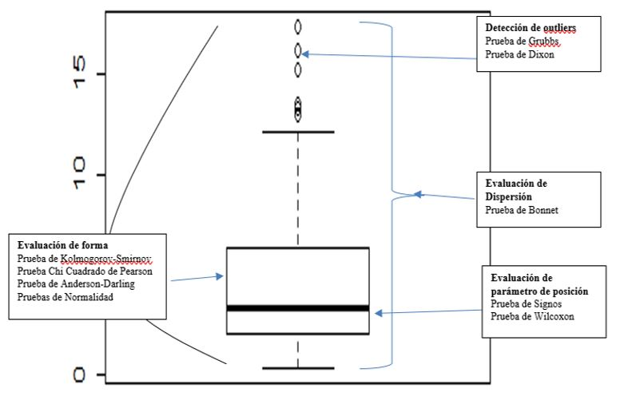

```{r setup, include=FALSE}
knitr::opts_chunk$set(echo = TRUE)
```

#  Introducción 

En algunas investigaciones, el objetivo es analizar el comportamiento de uno o varios parámetros de la(s) variable(s) de interés. 

Para realizar este análisis, se debe seleccionar una muestra aleatoria de tamaño n proveniente de la población de tamaño N. 

Esta muestra se obtiene por lo general siguiendo un esquema de Muestreo Aleatorio Simple (MAS) sin reemplazo

En otras palabras, un supuesto importante para poder aplicar las pruebas que se desarrollarán en esta unidad
es que los datos recolectados provienen de una muestra aleatoria (adicionalmente se presentarán supuestos propios para cada prueba). **Esto desmiente lo que algunos investigadores consideran erróneamente que las**
**pruebas no paramétricas no requieren del cumplimiento de supuestos**.


   

#  Prueba para evaluar una variable dicotomica

##  Prueba Binomial 

Esta prueba se emplea cuando se evalúan los datos provenientes **de una variable X que se puede expresar en forma dicotómica**. Los dos tipos de resultados se pueden clasificar en “éxito” o “fracaso” con lo que posteriormente se puede aplicar la función de probabilidad binomial para poder calcular la probabilidad de ocurrencia de la hipótesis nula formulada. Cada resultado pertenece a una de las clases, pero no a ambos.


El número de observaciones de la clase “éxito” es $O{1}$ y el número de observaciones de la clase “fracaso” es $O{2}$=n-$O{1}$.

**Supuestos**

* Los n elementos pertenecientes a la muestra son mutuamente independientes,
es decir la selección de un elemento no afecta la selección de otro elemento.

* Cada elemento tiene probabilidad $\pi$ de que resulte de la clase “éxito”, siendo 
$\pi$  el mismo para las n elementos.


### Inferencia Estadística

**PRUEBA DE HIPOTESIS**

Procedimiento para el desarrollo de la Prueba de Hipótesis

* Contabilizar el número de éxitos $O_{1}$ de la prueba

* Calcular el p-valor según la hipótesis alterna, mediante los criterios que a continuación se presentarán

Sea $\pi_{0}$ es alguna constante especificada, (0<$\pi_{0}$<1), es decir el valor hipotético a evaluar.


Es el valor hipotetico $\pi_{0}$  que el investigador sostiene y que quiere demostrar .

Las hipótesis pueden tomar alguna de las siguientes formas:


  

**PRUEBA ESTADÍSTICA **

Caso A

Suponga que $\alpha_{1}$ y $\alpha_{2}$ son los tamaños de la cola superior e inferior de la región
crítica, respectivamente, tal que $\alpha$= $\alpha_{1} + \alpha_{2}$ es el tamaño de la región crítica.

Luego se tendría que hallar t1 y t2 tal que:

P(Y≤t1) =$\alpha_{1}$ y P(Y≤t2) = 1-$\alpha_{2}$

Los valores de $\alpha_{1}$ y $\alpha_{2}$ podrían ser aproximadamente iguales.

**P-VALOR**

El pvalor se calcula dependiendo de la hipótesis alterna usando la distribución binomial.

Si se está interesado en la probabilidad de que el resultado sea de la clase “éxito”, entonces el estadístico de prueba **T está dado por el número de observaciones de la clase “éxito”**


$$T=O_{1}$$
El cálculo del p-valor para cada uno de los casos mencionados anteriormente es
de la siguiente manera:


**Si la muestra  es grande se puede usar la aproximación a la normal.**

$$Z=\frac{(O_{1}\pm0.5)-n\pi_{0}}{\sqrt {n\pi_{0}(1-\pi_{0})}}$$
Donde: O1+0.5 si x<n$\pi_{0}$ y O1-0.5 si x>n$\pi_{0}$

```{r}
#Z <- ((O1-0.5)-n*pi0)/sqrt(n*pi0(1-pi0))
#Z <- ((O1+0.5)-n*pi0)/sqrt(n*pi0(1-pi0))
```


**INTERVALO DE CONFIANZA PARA $\pi_{0}$ **

El intervalo exacto viene dado por la siguiente expresión:

$$LI(\pi)=\frac{O_{1}}{(n-O_{1}+1)F_{[1-\alpha/2,2(n-O_{1}+1),2O_{1}]}+O_{1}}$$
$$LS(\pi)=\frac{(O_{1}+1)F_{[1-\alpha/2,2(n-O_{1}+1],2O_{1}]}}{(n-O_{1})+(n+O_{1})F_{[1-\alpha/2,2(n-O_{1}+1],2O_{1}]}}$$

Cuando se tiene un tamaño de muestra grande, se puede hacer uso de la
aproximación a la normal. Con lo que se obtendría:


$$LI(\pi)=\frac{O_{1}}{n}-Z_{(1-\alpha/2)}\sqrt\frac{O_{1}(n-O_{1})}{n^3}$$
$$LS(\pi)=\frac{O_{1}}{n}+Z_{(1-\alpha/2)}\sqrt\frac{O_{1}(n-O_{1})}{n^3}$$

Puede deducirse que haciendo  $p= O_{1}/n$, este es el clásico intervalo para una proporción poblacional , el cual presenta muchas deficiencias. A esta última expresión de intervalo se le conoce como el intervalo para una proporción de Wald


### Ejemplo 1

A una muestra aleatoria de 26 degustadores igualmente entrenados se les dio a probar un nuevo sabor de refresco en tres vasos, los cuales les fueron proporcionados de manera aleatoria. Dos de los vasos tenían igual cantidad del saborizante (ingrediente base del refresco) y un vaso tenía una mayor cantidad de saborizante. A los degustadores se les pidió que identifiquen el vaso que contenía la mayor cantidad de saborizante. Dieciocho degustadores identificaron correctamente que vaso contenía mayor cantidad de saborizante. Pruebe si la proporción de degustadores que realizaron la correcta identificación es mayor a 1/3. De sus conclusiones a un nivel de significación de 0.05.


**Sea Y: Número de degustadores que identificaron correctamente que vaso contenía mayor cantidad de saborizante.**

n:26 desgustadores 

2 igual saborizante
1 mañor cantidad saborizante 

18 identificaron correctamente que vaso contenia la mayor cantidad de saborizante

Pruebe si la proporción de degustadores que realizaron la correcta identificación >1/3

alpha: 0.05


**Prueba de hipotesis**

$H0:\pi\leq \frac{1}{3}$

$H1:\pi>\frac{1}{3}$

**Nivel de significación**
$\alpha=0.05$

**Prueba Estadística**

$T=O_{1}=18$

Asumiendo $Y\sim Binomial(26,1/3)\sim Binomial(N,\pi)$

$P(X = x)=f(x) = \binom nx \pi^x(1 - \pi)^{n-x} \quad  x =0,1..,n$


**P VALOR **

$P-valor= P[Y\geq18]=\sum_{y=18}^{26}=\binom {26}{y}(\frac{1}{3})^y(\frac{2}{3})^{26-y}$

```{r}
#P-valor= P[Y≥18]
y <- c(18:26) 
sum(choose(26,y)*(1/3)^y*(1-(1/3))^(26-y)) # Probabilidad acumulada de 18 hasta 26 

y <- c(0:17) 
1-sum(choose(26,y)*(1/3)^y*(1-(1/3))^(26-y)) # Probabilidad acumulada hasta 17
```


**PValor En R**
```{r}
#P-valor= P[Y≥18]  Tener en cuenta que es una variable aleatoria discreta 
1-pbinom(17,26,1/3)

#La opción lower.tail permite calcular P(X>x)
pbinom(17,26,1/3,lower.tail=FALSE)#lower.tail=FALSE  (en intervalos)

```
**P-valor= 0.0001971944 <alfa Se Rechaza H0**


**Para la prueba de hipótesis**

```{r}
#greater (mayor) H1:π>1/3

# binom.test(O1,n,valor hipotético, alternative, conf.level)
binom.test(18,26,1/3,alternative="greater",conf.level = 0.95)
```

Conclusión
A un nivel de significación de 0.05, Se rechaza H0. Por lo tanto, se puede afirmar que la proporción de degustadores que identifican correctamente el vaso que contenía mayor cantidad de saborizante es mayor a
1/3.


**Para el intervalo de confianza de la proporcion **
```{r}
binom.test(18,26,1/3,alternative="two.sided",conf.level = 0.95)#Interalo de confinaza (percent confidence interval)
```

# Pruebas para evaluar supuestos 
## Pruebas para determinar la distribución de los datos
###  Prueba de Cramer von Mises 


## Prueba de normalidad 
### Prueba de shapiro  
Depende mucho del tamaño de muestra

shapiro()
